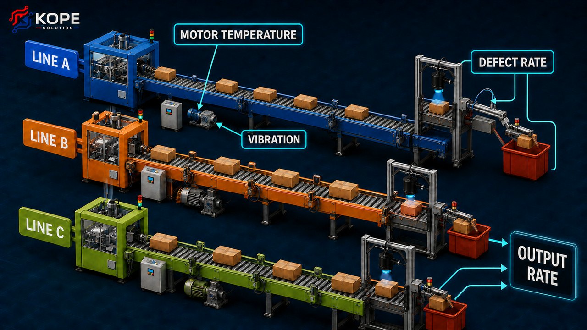

# EP8 — Multiple Subplots for Manufacturing Production Monitoring

กราฟหนึ่งรูปตอบคำถามได้หนึ่งมุม แต่การตัดสินใจในโรงงานมักต้องดูหลายตัวแปรพร้อมกัน เช่น อัตราการผลิตลดลงหรือไม่ อุณหภูมิ Motor สูงขึ้นพร้อมกับแรงสั่นสะเทือนหรือเปล่า และ Defect Rate เปลี่ยนไปในช่วงเวลาเดียวกันหรือไม่

บทนี้ใช้ **ระบบติดตามสายการผลิตในโรงงานบรรจุภัณฑ์** เป็นกรณีศึกษา เพื่อเรียนรู้การวางหลาย Axes ภายใน Figure เดียว ตั้งแต่กริดพื้นฐานไปจนถึง Dashboard ที่แต่ละกราฟใช้พื้นที่ไม่เท่ากัน

ตัวอย่าง ข้อมูล โครงเรื่อง และคำอธิบายทั้งหมดเรียบเรียงขึ้นใหม่สำหรับชุดวิดีโอนี้ ข้อมูลเป็นข้อมูลสังเคราะห์ ไม่ใช่ข้อมูลจากโรงงานจริง และไม่ควรใช้ Threshold ในบทนี้เป็นเกณฑ์ควบคุมเครื่องจักร

*อ่านภาพจากซ้ายไปขวา: Line A–C แต่ละ Line มี Motor/ชุดเกียร์และสถานีตรวจสอบคุณภาพของตัวเอง ส่วนข้อมูล `motor_temperature`, `vibration` และ `defect_rate` ในบทนี้ใช้เป็นค่าตัวแทนหรือค่ารวม เพื่อเน้นการเรียนรู้เรื่อง Multiple Subplots โดยไม่ทำให้ชุดข้อมูลซับซ้อนเกินไป*

## วิธีเรียนจากบทนี้

- รันเซลล์ตามลำดับจากบนลงล่าง
- เริ่มจาก `plt.subplots()` ก่อน แล้วจึงเรียนเครื่องมือ Layout ที่ละเอียดขึ้น
- ตรวจ Shape ของตัวแปร `axes` ทุกครั้งที่เปลี่ยนจำนวนแถวหรือคอลัมน์
- ใช้ `layout="constrained"` ตั้งแต่ตอนสร้าง Figure เมื่อ Label เริ่มซ้อนกัน
- ทดลองเปลี่ยนจำนวนกราฟ อัตราส่วนพื้นที่ และการ Share Axis
- สคริปต์ฉบับเต็มอยู่ในโฟลเดอร์ [source-code](./source-code/)

## วัตถุประสงค์การเรียนรู้

เมื่อเรียนจบบทนี้ คุณจะสามารถ:

- อธิบายความสัมพันธ์ระหว่าง Figure, Axes, Axis และ Subplot
- สร้างกราฟหลายช่องด้วย `plt.subplots()`
- เข้าถึง Axes แบบ Scalar, Array หนึ่งมิติ และ Array สองมิติ
- วนลูปผ่าน Axes ด้วย `axes.flat`
- ใช้ `sharex` และ `sharey` เมื่อกราฟมี Scale ที่ควรเปรียบเทียบร่วมกัน
- กำหนดขนาดคอลัมน์และแถวด้วย `width_ratios` และ `height_ratios`
- เข้าใจรูปแบบ Index แบบเริ่มที่ 1 ของ `subplot()` และ `add_subplot()`
- วาง Axes ด้วยพิกัด Figure ผ่าน `fig.add_axes()`
- สร้าง Layout ที่กราฟกินหลายช่องด้วย `GridSpec`
- สร้าง Layout ที่อ่านชื่อพื้นที่ได้ง่ายด้วย `subplot_mosaic()`
- เลือกใช้ `layout="constrained"` หรือ `subplots_adjust()` อย่างเหมาะสม
- ออกแบบ Manufacturing Dashboard ที่เปรียบเทียบข้อมูลได้โดยไม่ทำให้ Figure แน่นเกินไป

## คำศัพท์สำคัญก่อนเริ่ม

| คำศัพท์ | ความหมาย |
|---------|----------|
| Figure | พื้นที่ภาพทั้งหมดที่บรรจุ Axes, Title, Legend และองค์ประกอบอื่น |
| Axes | พื้นที่กราฟหนึ่งช่อง เช่นกราฟอุณหภูมิหนึ่งช่อง |
| Axis | ระบบแกน X หรือแกน Y ภายใน Axes ไม่ใช่คำเดียวกับ Axes |
| Subplot | Axes ที่ถูกจัดตำแหน่งเป็นส่วนหนึ่งของ Layout ภายใน Figure |
| Grid | โครงแถวและคอลัมน์ที่ใช้แบ่งพื้นที่ให้ Subplot |
| Shared axis | แกนที่ใช้ Limit, Tick หรือ Scale ร่วมกันระหว่างหลาย Axes |
| `GridSpec` | Object ที่อธิบายโครงตารางและพื้นที่ที่แต่ละ Axes จะครอบครอง |
| Mosaic | Layout ที่ตั้งชื่อพื้นที่กราฟด้วยข้อความแทนการจำ Index |
| Inset | Axes ขนาดเล็กที่วางเพิ่มเติมเพื่อขยายหรือสรุปข้อมูลบางส่วน |
| Layout engine | กลไกที่ช่วยจัดระยะระหว่าง Axes, Label, Legend และ Colorbar |

### Figure, Axes และ Axis ต่างกันอย่างไร

ให้คิดว่า Figure เป็นกระดานหนึ่งแผ่น ภายในกระดานมี Axes หลายช่อง และแต่ละ Axes มี X Axis กับ Y Axis ของตัวเอง

~~~text
Figure
├── Axes: Output rate
│   ├── X Axis: Shift hour
│   └── Y Axis: Units/min
├── Axes: Motor temperature
└── Axes: Defect rate
~~~

คำว่า `axes` ที่ใช้เป็นชื่อตัวแปรมักหมายถึงกลุ่มของ Axes หลาย Object ส่วน `axis` หมายถึงแกนหนึ่งด้านภายในกราฟ ต้องสังเกตตัวอักษร `e` และบริบทให้ดี

---

## 1. เตรียมไลบรารีและข้อมูลสายการผลิต

### เซลล์ที่ 1 — Import

~~~python
import numpy as np
import matplotlib.pyplot as plt
~~~

ติดตั้งไลบรารีได้ด้วย:

~~~bash
python -m pip install numpy matplotlib
~~~

### เซลล์ที่ 2 — สร้างเวลาและข้อมูลสังเคราะห์

~~~python
rng = np.random.default_rng(8)

minutes = np.arange(0, 480, 10)
shift_hour = minutes / 60

production_cycle = np.sin(
    2 * np.pi * (minutes + 30) / 480
)

line_a = (
    90
    + 7 * production_cycle
    + rng.normal(0, 2.0, minutes.size)
)

line_b = (
    85
    + 6 * np.sin(
        2 * np.pi * (minutes + 70) / 480
    )
    + rng.normal(0, 2.2, minutes.size)
)

line_c = (
    93
    + 5 * np.sin(
        2 * np.pi * (minutes + 10) / 480
    )
    + rng.normal(0, 1.8, minutes.size)
)

motor_temperature = (
    54
    + 0.032 * minutes
    + 1.8 * np.sin(
        2 * np.pi * minutes / 180
    )
    + rng.normal(0, 0.6, minutes.size)
)

vibration = np.clip(
    1.9
    + 0.0025 * minutes
    + 0.25 * np.sin(
        2 * np.pi * minutes / 120
    )
    + rng.normal(0, 0.09, minutes.size),
    0,
    None,
)

defect_rate = np.clip(
    1.8
    + 0.045 * (motor_temperature - 54)
    + 0.22 * np.sin(
        2 * np.pi * minutes / 160
    )
    + rng.normal(0, 0.12, minutes.size),
    0,
    None,
)
~~~

ข้อมูลหนึ่งกะมีระยะเวลา 480 นาที และวัดทุก 10 นาที จึงมี 48 จุดต่อชุดข้อมูล

- `line_a`, `line_b`, `line_c` แทนอัตราการผลิตของสามสายการผลิต
- `motor_temperature` แทนอุณหภูมิ Motor ของ Line A
- `vibration` แทนความเร็วการสั่นสะเทือนโดยสมมติให้มีหน่วย mm/s
- `defect_rate` แทนสัดส่วนชิ้นงานที่ตรวจพบข้อบกพร่อง
- สูตรทั้งหมดมีไว้สร้างข้อมูลสำหรับฝึกวาดกราฟ ไม่ใช่แบบจำลองทางวิศวกรรม

### เซลล์ที่ 3 — ตรวจ Shape และช่วงค่า

~~~python
print("Samples:", minutes.size)
print("Line A shape:", line_a.shape)
print(
    "Motor temperature:",
    motor_temperature.min(),
    motor_temperature.max(),
)
print(
    "Defect rate:",
    defect_rate.min(),
    defect_rate.max(),
)
~~~

ข้อมูลที่ใช้แกนเวลาร่วมกันต้องมีจำนวนจุดตรงกัน หาก Array หนึ่งมี 47 ค่า แต่อีก Array มี 48 ค่า การเปรียบเทียบตำแหน่งตามเวลาอาจผิดหรือ Plot ไม่ได้

---

## 2. Subplot แรกด้วย `plt.subplots()`

เครื่องมือที่ควรเริ่มใช้สำหรับ Layout แบบทั่วไปคือ `plt.subplots()` เพราะสร้าง Figure และ Axes ที่ต้องการให้พร้อมในคำสั่งเดียว

### เซลล์ที่ 4 — สร้างกราฟ 1 แถว 2 คอลัมน์

~~~python
fig, axes = plt.subplots(
    1,
    2,
    figsize=(11, 4.5),
    layout="constrained",
)

axes[0].plot(
    shift_hour,
    line_a,
    color="tab:blue",
)
axes[0].set(
    title="Line A Output Rate",
    xlabel="Shift hour",
    ylabel="Output rate (units/min)",
)

axes[1].plot(
    shift_hour,
    defect_rate,
    color="tab:red",
)
axes[1].set(
    title="Line A Defect Rate",
    xlabel="Shift hour",
    ylabel="Defect rate (%)",
)

for ax in axes:
    ax.grid(alpha=0.25)

plt.show()
~~~

ค่าที่คืนกลับมามีสองส่วน:

- `fig` เป็น Figure หนึ่ง Object
- `axes` เป็น NumPy Array ที่เก็บ Axes สอง Object

ในกรณี 1 แถว 2 คอลัมน์ `axes.shape` เท่ากับ `(2,)` จึงเข้าถึงด้วย `axes[0]` และ `axes[1]`

### ทำไมใช้ชื่อ `axes` ไม่ใช่ `ax`

ไม่มีข้อบังคับเรื่องชื่อตัวแปร แต่รูปแบบที่อ่านง่ายคือ:

~~~python
fig, ax = plt.subplots()
~~~

เมื่อมี Axes เดียว และใช้:

~~~python
fig, axes = plt.subplots(2, 2)
~~~

เมื่อมีหลาย Axes ชื่อนี้ช่วยเตือนว่าเรากำลังทำงานกับ Array ไม่ใช่ Axes เดี่ยว

---

## 3. Shape ของ `axes` และ Parameter `squeeze`

ค่า Return ของ `plt.subplots()` เปลี่ยนรูปตามจำนวนแถวและคอลัมน์:

| คำสั่ง | ชนิดหรือ Shape ของค่าที่คืน |
|--------|-----------------------------|
| `plt.subplots()` | Axes เดี่ยว ไม่ใช่ Array |
| `plt.subplots(1, 3)` | Array หนึ่งมิติ Shape `(3,)` |
| `plt.subplots(3, 1)` | Array หนึ่งมิติ Shape `(3,)` |
| `plt.subplots(2, 3)` | Array สองมิติ Shape `(2, 3)` |

### เซลล์ที่ 5 — ตรวจ Shape ของกริด 2×2

~~~python
fig, axes = plt.subplots(2, 2)

print(type(axes))
print(axes.shape)

plt.close(fig)
~~~

เมื่อเป็นกริด 2×2 ให้เข้าถึงแบบ `[row, column]`:

~~~python
axes[0, 0]  # ซ้ายบน
axes[0, 1]  # ขวาบน
axes[1, 0]  # ซ้ายล่าง
axes[1, 1]  # ขวาล่าง
~~~

Index ของ NumPy เริ่มที่ 0 จึงไม่เหมือน `subplot()` แบบตัวเลขซึ่งเริ่มตำแหน่งที่ 1

หากต้องการให้ค่าที่คืนเป็น Array สองมิติเสมอ สามารถใช้:

~~~python
fig, axes = plt.subplots(
    1,
    1,
    squeeze=False,
)

print(axes.shape)  # (1, 1)
plt.close(fig)
~~~

`squeeze=False` มีประโยชน์ใน Function ที่จำนวนแถวหรือคอลัมน์เปลี่ยนตาม Input เพราะโค้ดสามารถใช้ `axes[row, column]` ในรูปแบบเดิมได้ตลอด

---

## 4. Dashboard 2×2 และการวนลูปผ่าน Axes

### เซลล์ที่ 6 — แสดงสี่ตัวแปรใน Figure เดียว

~~~python
fig, axes = plt.subplots(
    2,
    2,
    figsize=(11, 7),
    sharex=True,
    layout="constrained",
)

series = [
    (
        line_a,
        "Line A Output Rate",
        "Output rate (units/min)",
        "tab:blue",
    ),
    (
        motor_temperature,
        "Motor Temperature",
        "Temperature (°C)",
        "tab:orange",
    ),
    (
        vibration,
        "Motor Vibration",
        "Vibration (mm/s)",
        "tab:green",
    ),
    (
        defect_rate,
        "Defect Rate",
        "Defect rate (%)",
        "tab:red",
    ),
]

for ax, (values, title, ylabel, color) in zip(
    axes.flat,
    series,
):
    ax.plot(
        shift_hour,
        values,
        color=color,
        linewidth=2,
    )
    ax.set(
        title=title,
        ylabel=ylabel,
    )
    ax.grid(alpha=0.25)

for ax in axes[-1, :]:
    ax.set_xlabel("Shift hour")

fig.suptitle(
    "Packaging Line A — Shift Monitoring"
)

plt.show()
~~~

`axes.flat` ทำให้ Array 2×2 ถูกมองเป็นลำดับ Axes ต่อเนื่อง จึงจับคู่กับรายการ `series` ผ่าน `zip()` ได้โดยไม่ต้องเขียน Plot ซ้ำสี่ครั้ง

ข้อควรระวังคือ `zip()` จะหยุดเมื่อรายการที่สั้นกว่าหมด หากมี Axes หกช่องแต่มีข้อมูลเพียงสี่ชุด Axes ที่เหลือจะยังว่าง สามารถปิดด้วย:

~~~python
for ax in axes.flat[len(series):]:
    ax.set_visible(False)
~~~

---

## 5. `sharex` และ `sharey`

การ Share Axis ทำให้หลาย Axes ใช้ Scale และ Tick ที่สัมพันธ์กัน ช่วยให้เปรียบเทียบตำแหน่งตามเวลาได้ง่ายขึ้น

### เซลล์ที่ 7 — เปรียบเทียบสามสายการผลิต

~~~python
fig, axes = plt.subplots(
    3,
    1,
    figsize=(10, 7),
    sharex=True,
    sharey=True,
    layout="constrained",
)

line_series = [
    (line_a, "Line A", "tab:blue"),
    (line_b, "Line B", "tab:orange"),
    (line_c, "Line C", "tab:green"),
]

for ax, (values, label, color) in zip(
    axes,
    line_series,
):
    ax.plot(
        shift_hour,
        values,
        color=color,
        linewidth=2,
    )
    ax.axhline(
        90,
        color="gray",
        linestyle="--",
        linewidth=1.2,
    )
    ax.set_ylabel(label)
    ax.grid(alpha=0.25)

axes[-1].set_xlabel("Shift hour")
fig.suptitle(
    "Output Rate by Production Line"
)

plt.show()
~~~

ตัวอย่างนี้ใช้ `sharex=True` เพราะทุกกราฟอ้างถึงกะเวลาเดียวกัน และใช้ `sharey=True` เพราะทุกกราฟมีหน่วย Output Rate เหมือนกัน การใช้ช่วง Y เดียวกันช่วยให้เห็นความต่างจริงโดยไม่ถูก Auto Scale ของแต่ละ Axes หลอกสายตา

ไม่ควร Share Y Axis ระหว่างอุณหภูมิหน่วย °C กับแรงสั่นสะเทือนหน่วย mm/s เพราะความหมายและ Scale ไม่เหมือนกัน

ค่าที่ใช้ได้กับ `sharex` และ `sharey` ได้แก่ `False`, `True`, `"all"`, `"row"` และ `"col"` เมื่อ Share แล้ว Tick Label ด้านในบางส่วนจะถูกซ่อนอัตโนมัติเพื่อลดความซ้ำซ้อน

---

## 6. `subplot()` และ `add_subplot()` แบบระบุตำแหน่งทีละช่อง

ตัวอย่างเก่าจำนวนมากใช้:

~~~python
plt.subplot(2, 2, 1)
~~~

ตัวเลขหมายถึง:

~~~text
(จำนวนแถว, จำนวนคอลัมน์, ตำแหน่ง)
~~~

ตำแหน่งเริ่มที่ 1 และไล่จากซ้ายไปขวา บนลงล่าง:

~~~text
1  2
3  4
~~~

ในโค้ดที่ใช้ Object-oriented API ควรเขียนผ่าน Figure ให้ชัดเจน:

### เซลล์ที่ 8 — เพิ่ม Axes ทีละช่อง

~~~python
fig = plt.figure(
    figsize=(10, 6),
    layout="constrained",
)

plot_specs = [
    (line_a, "Output Rate", "units/min"),
    (
        motor_temperature,
        "Motor Temperature",
        "°C",
    ),
    (vibration, "Vibration", "mm/s"),
    (defect_rate, "Defect Rate", "%"),
]

for position, (values, title, unit) in enumerate(
    plot_specs,
    start=1,
):
    ax = fig.add_subplot(2, 2, position)
    ax.plot(shift_hour, values)
    ax.set(
        title=title,
        xlabel="Shift hour",
        ylabel=unit,
    )
    ax.grid(alpha=0.25)

plt.show()
~~~

`fig.add_subplot()` เหมาะเมื่อสร้าง Axes ทีละช่องหรือต้องกำหนด Projection ของบางช่อง แต่ถ้าต้องการกริดครบทั้งชุด `plt.subplots()` มักสั้นและเข้าถึง Axes ได้สะดวกกว่า

รูปแบบย่ออย่าง `plt.subplot(221)` ยังพบได้ในโค้ดเก่า แต่ `plt.subplot(2, 2, 1)` อ่านความหมายได้ชัดกว่า

---

## 7. ปรับพื้นที่ด้วย `width_ratios` และ `height_ratios`

กราฟทุกช่องไม่จำเป็นต้องกว้างเท่ากัน ตัวอย่างเช่นกราฟแนวโน้มตามเวลาควรได้พื้นที่มากกว่า Summary ขนาดเล็ก

### เซลล์ที่ 9 — ให้กราฟซ้ายกว้างเป็นสองเท่า

~~~python
fig, axes = plt.subplots(
    1,
    2,
    figsize=(11, 4.5),
    width_ratios=[2, 1],
    layout="constrained",
)

axes[0].plot(
    shift_hour,
    line_a,
    color="tab:blue",
)
axes[0].set(
    title="Line A Output Trend",
    xlabel="Shift hour",
    ylabel="Output rate (units/min)",
)

mean_output = [
    line_a.mean(),
    line_b.mean(),
    line_c.mean(),
]

axes[1].bar(
    ["A", "B", "C"],
    mean_output,
    color=[
        "tab:blue",
        "tab:orange",
        "tab:green",
    ],
)
axes[1].set(
    title="Average Output",
    xlabel="Production line",
    ylabel="Units/min",
)

for ax in axes:
    ax.grid(axis="y", alpha=0.25)

plt.show()
~~~

`width_ratios=[2, 1]` เป็นอัตราส่วน ไม่ใช่หน่วย Pixel คอลัมน์แรกจึงได้รับพื้นที่ประมาณสองส่วนจากพื้นที่รวมสามส่วน ส่วน `height_ratios` ใช้หลักเดียวกันกับความสูงของแถว

---

## 8. จัดระยะด้วย Layout Engine

Title, Tick Label และชื่อแกนอาจซ้อนกันเมื่อมีหลาย Subplot แนวทางแรกที่ควรทดลองคือสร้าง Figure พร้อม:

~~~python
layout="constrained"
~~~

Constrained Layout ช่วยปรับตำแหน่ง Axes เพื่อหลีกเลี่ยงการชนของ Label, Title, Legend และ Colorbar หลายกรณี ควรเปิดตั้งแต่ตอนสร้าง Figure หรือ Subplots

อีกทางเลือกคือปรับด้วยตนเอง:

~~~python
fig.subplots_adjust(
    wspace=0.35,
    hspace=0.45,
)
~~~

- `wspace` คือพื้นที่แนวนอนระหว่าง Subplot ในสัดส่วนของความกว้าง Axes โดยเฉลี่ย
- `hspace` คือพื้นที่แนวตั้งระหว่าง Subplot ในสัดส่วนของความสูง Axes โดยเฉลี่ย

ควรเลือกแนวทางหลักหนึ่งแบบต่อ Figure อย่าเปิด Constrained Layout แล้วพยายามควบคุมตำแหน่งทั้งหมดด้วย `subplots_adjust()` พร้อมกัน เพราะ Layout Engine อาจจัดวางไม่ตรงกับที่คาด

`fig.tight_layout()` ยังใช้งานได้และเหมาะกับ Layout ทั่วไป แต่ Constrained Layout รองรับกรณีซับซ้อน เช่น Axes ที่กินหลายช่องและ Colorbar หลาย Axes ได้ยืดหยุ่นกว่า

---

## 9. วาง Axes ด้วย `fig.add_axes()`

`fig.add_axes()` รับรายการตัวเลขสี่ค่า:

~~~python
[left, bottom, width, height]
~~~

ทุกค่าเป็นสัดส่วนของ Figure ตั้งแต่ 0 ถึง 1:

- `left` ระยะจากขอบซ้ายถึงจุดเริ่ม Axes
- `bottom` ระยะจากขอบล่างถึงจุดเริ่ม Axes
- `width` ความกว้างของ Axes
- `height` ความสูงของ Axes

### เซลล์ที่ 10 — สร้างกราฟหลักและกราฟย่อย

~~~python
fig = plt.figure(figsize=(11, 6))

main_ax = fig.add_axes(
    [0.09, 0.13, 0.82, 0.77]
)
inset_ax = fig.add_axes(
    [0.61, 0.57, 0.25, 0.24]
)

main_ax.plot(
    shift_hour,
    line_a,
    color="tab:blue",
    linewidth=2.5,
)
main_ax.axhline(
    90,
    color="gray",
    linestyle="--",
)
main_ax.set(
    title="Line A Output Rate",
    xlabel="Shift hour",
    ylabel="Output rate (units/min)",
)
main_ax.grid(alpha=0.25)

inset_ax.plot(
    shift_hour,
    defect_rate,
    color="tab:red",
)
inset_ax.set_title(
    "Defect Rate",
    fontsize=10,
)
inset_ax.tick_params(labelsize=8)
inset_ax.grid(alpha=0.2)

plt.show()
~~~

จุดเริ่มของ Axes วัดจากมุมซ้ายล่างของ Figure จึงต่างจากการจัดหน้าเว็บที่มักเริ่มจากมุมซ้ายบน

`add_axes()` ให้การควบคุมตำแหน่งโดยตรง แต่ Layout ปรับตามขนาดหน้าจอหรือข้อความได้ยากกว่า เหมาะกับ Inset หรือ Layout คงที่มากกว่ากริด Dashboard ทั่วไป

---

## 10. `GridSpec` สำหรับ Layout ที่กินหลายช่อง

`GridSpec` สร้างโครงตาราง แต่ยังไม่วาดกราฟ เราต้องนำตำแหน่งจาก Grid ไปสร้าง Axes ผ่าน `fig.add_subplot()`

### เซลล์ที่ 11 — Dashboard แบบ 2×3

~~~python
fig = plt.figure(
    figsize=(13, 7.5),
    layout="constrained",
)

grid = fig.add_gridspec(
    2,
    3,
    width_ratios=[1.3, 1.3, 1],
    height_ratios=[1.2, 1],
)

output_ax = fig.add_subplot(grid[0, :2])
summary_ax = fig.add_subplot(grid[0, 2])
temperature_ax = fig.add_subplot(grid[1, 0])
vibration_ax = fig.add_subplot(grid[1, 1])
quality_ax = fig.add_subplot(grid[1, 2])

output_ax.plot(
    shift_hour,
    line_a,
    label="Line A",
)
output_ax.plot(
    shift_hour,
    line_b,
    label="Line B",
)
output_ax.plot(
    shift_hour,
    line_c,
    label="Line C",
)
output_ax.set(
    title="Output Rate During the Shift",
    xlabel="Shift hour",
    ylabel="Units/min",
)
output_ax.legend(ncols=3)

summary_ax.barh(
    ["Line A", "Line B", "Line C"],
    [
        line_a.mean(),
        line_b.mean(),
        line_c.mean(),
    ],
    color=[
        "tab:blue",
        "tab:orange",
        "tab:green",
    ],
)
summary_ax.set(
    title="Average Output",
    xlabel="Units/min",
)

temperature_ax.plot(
    shift_hour,
    motor_temperature,
    color="tab:orange",
)
temperature_ax.set(
    title="Motor Temperature",
    xlabel="Shift hour",
    ylabel="°C",
)

vibration_ax.plot(
    shift_hour,
    vibration,
    color="tab:green",
)
vibration_ax.set(
    title="Vibration",
    xlabel="Shift hour",
    ylabel="mm/s",
)

quality_ax.plot(
    shift_hour,
    defect_rate,
    color="tab:red",
)
quality_ax.set(
    title="Defect Rate",
    xlabel="Shift hour",
    ylabel="%",
)

for ax in fig.axes:
    ax.grid(alpha=0.22)

fig.suptitle(
    "Packaging Factory — Shift Overview"
)

plt.show()
~~~

ตำแหน่งสำคัญคือ:

- `grid[0, :2]` หมายถึงแถวบนและคอลัมน์ตั้งแต่ต้นจนถึงก่อนคอลัมน์ที่ 2 จึงกินสองช่องแรก
- `grid[0, 2]` หมายถึงช่องขวาบน
- `grid[1, 0]`, `grid[1, 1]`, `grid[1, 2]` คือสามช่องในแถวล่าง

Slicing ของ `GridSpec` ใช้แนวคิดเดียวกับ NumPy แต่ค่าที่ได้คือ `SubplotSpec` ซึ่งบอกพื้นที่ ไม่ใช่ข้อมูลตัวเลข

---

## 11. `subplot_mosaic()` ตั้งชื่อพื้นที่แทน Index

เมื่อ Layout เริ่มซับซ้อน ชื่ออย่าง `output_ax` อ่านง่ายกว่า `axes[0, 1]` ฟังก์ชัน `subplot_mosaic()` ให้เราวาดแผนผังด้วยชื่อแล้วคืน Axes เป็น Dictionary

### เซลล์ที่ 12 — Dashboard แบบตั้งชื่อช่อง

~~~python
layout = [
    ["output", "output", "quality"],
    ["temperature", "vibration", "quality"],
]

fig, axes = plt.subplot_mosaic(
    layout,
    figsize=(13, 7),
    width_ratios=[1.2, 1.2, 1],
    layout="constrained",
)

axes["output"].plot(
    shift_hour,
    line_a,
    label="Line A",
)
axes["output"].plot(
    shift_hour,
    line_b,
    label="Line B",
)
axes["output"].plot(
    shift_hour,
    line_c,
    label="Line C",
)
axes["output"].set(
    title="Output Rate",
    xlabel="Shift hour",
    ylabel="Units/min",
)
axes["output"].legend(ncols=3)

axes["temperature"].plot(
    shift_hour,
    motor_temperature,
    color="tab:orange",
)
axes["temperature"].set(
    title="Motor Temperature",
    xlabel="Shift hour",
    ylabel="°C",
)

axes["vibration"].plot(
    shift_hour,
    vibration,
    color="tab:green",
)
axes["vibration"].set(
    title="Vibration",
    xlabel="Shift hour",
    ylabel="mm/s",
)

axes["quality"].plot(
    defect_rate,
    shift_hour,
    color="tab:red",
)
axes["quality"].set(
    title="Quality Trend",
    xlabel="Defect rate (%)",
    ylabel="Shift hour",
)

for ax in axes.values():
    ax.grid(alpha=0.22)

fig.suptitle(
    "Packaging Line Monitoring Mosaic"
)

plt.show()
~~~

ชื่อ `"output"` ปรากฏสองช่องติดกันในแถวบน จึงกลายเป็น Axes เดียวที่กินสองคอลัมน์ ส่วน `"quality"` ปรากฏต่อกันในคอลัมน์ขวา จึงกินสองแถว

หากใช้ `"."` ใน Layout ตำแหน่งนั้นจะถูกปล่อยว่างโดยค่าเริ่มต้น Mosaic เหมาะกับ Dashboard ที่ต้องอ่านและแก้ Layout บ่อย เพราะชื่อพื้นที่บอกหน้าที่ของกราฟโดยตรง

---

## 12. ใส่ชื่อรวมและป้ายกำกับแต่ละ Panel

`ax.set_title()` ตั้งชื่อเฉพาะ Axes ส่วน `fig.suptitle()` ตั้งชื่อรวมของ Figure

ในการอ้างถึง Panel ระหว่างอธิบาย สามารถเพิ่มตัวอักษรได้:

~~~python
for label, ax in zip(
    ["A", "B", "C", "D"],
    axes.flat,
):
    ax.text(
        0.02,
        0.95,
        label,
        transform=ax.transAxes,
        fontsize=12,
        fontweight="bold",
        va="top",
    )
~~~

`transform=ax.transAxes` ทำให้ตำแหน่งข้อความใช้พิกัดของ Axes ตั้งแต่ 0 ถึง 1 ไม่ได้ใช้ค่าข้อมูลบนแกน จึงวางตัวอักษรไว้ตำแหน่งเดิมได้แม้ข้อมูลแต่ละกราฟมีช่วงต่างกัน

---

## 13. ปิด Axes ที่ไม่ได้ใช้

บางครั้งจำนวนกราฟไม่พอดีกับกริด เช่นมีข้อมูลห้าชุดแต่สร้าง Layout 2×3 สามารถซ่อนช่องสุดท้ายได้:

~~~python
fig, axes = plt.subplots(
    2,
    3,
    figsize=(12, 7),
    layout="constrained",
)

for ax in axes.flat[-1:]:
    ax.set_visible(False)
~~~

อีกวิธีคือ:

~~~python
fig.delaxes(axes[1, 2])
~~~

`set_visible(False)` เก็บ Axes ไว้แต่ไม่แสดง ส่วน `delaxes()` นำ Axes ออกจาก Figure การซ่อนช่องว่างช่วยให้ผู้ชมไม่เข้าใจผิดว่ากราฟโหลดไม่สำเร็จ

---

## 14. เลือกเครื่องมือ Layout อย่างไร

| ความต้องการ | เครื่องมือที่เหมาะสม |
|-------------|----------------------|
| Figure เดียว Axes เดียว | `plt.subplots()` |
| กริดแถวและคอลัมน์ทั่วไป | `plt.subplots(nrows, ncols)` |
| เพิ่ม Axes ทีละตำแหน่ง | `fig.add_subplot()` |
| อ่านโค้ดเก่าที่ใช้ Current Figure | `plt.subplot()` |
| กำหนดตำแหน่งเป็นสัดส่วน Figure โดยตรง | `fig.add_axes()` |
| ให้บางกราฟกินหลายแถวหรือคอลัมน์ | `fig.add_gridspec()` |
| ต้องการเรียก Axes ด้วยชื่อ | `plt.subplot_mosaic()` |
| ปรับพื้นที่คอลัมน์หรือแถวแบบง่าย | `width_ratios`, `height_ratios` |
| ลดการซ้อนของ Label อัตโนมัติ | `layout="constrained"` |
| ควบคุมช่องว่างด้วยตนเอง | `fig.subplots_adjust()` |

สำหรับงานใหม่ให้เริ่มจาก `plt.subplots()` หรือ `subplot_mosaic()` ก่อน แล้วใช้ `GridSpec` เมื่อ Layout ต้องการอิสระมากขึ้น `add_axes()` เหมาะกับตำแหน่งคงที่หรือ Inset มากกว่าการสร้าง Dashboard ทั้งหน้า

---

## 15. แนวทางออกแบบ Dashboard สำหรับโรงงาน

### จัดกลุ่มตามคำถาม

- Output ของแต่ละ Line ใช้หน่วยเดียวกัน จึงวางใกล้กันหรือ Share Y Axis ได้
- Condition Monitoring เช่น Temperature และ Vibration ควรอยู่กลุ่มเดียวกัน แต่ไม่ควร Share Y Axis เพราะหน่วยต่างกัน
- Quality Metric ควรมีหน่วยและช่วงเวลาเดียวกับข้อมูลการผลิตเมื่อต้องการหาความสัมพันธ์

### รักษา Scale ที่เปรียบเทียบได้

- กราฟที่มีหน่วยเดียวกันควรใช้ช่วงแกนใกล้เคียงกัน
- อย่าให้แต่ละ Axes Auto Scale จนเส้นดูผันผวนเท่ากันทั้งที่ขนาดต่างกันมาก
- ถ้าตัดแกน Y ไม่เริ่มที่ศูนย์ ต้องสื่อสารให้ชัด โดยเฉพาะ Bar Chart

### ลดความแน่นของข้อมูล

- อย่าใส่ทุก Sensor ลง Figure เดียวเพียงเพราะทำได้
- ใช้ Summary, Filter หรือแยก Dashboard ตามงานของ Operator
- Font, Tick และ Legend ต้องอ่านได้บนจอควบคุมจริง
- ตรวจ Figure หลัง Export เพราะ Label ด้านนอกอาจถูกตัด

### เวลาและหน่วยต้องตรงกัน

- ตรวจ Timestamp, Timezone และ Sample Interval ก่อน Share X Axis
- อย่าเชื่อมจุดข้ามช่วงที่เครื่องจักร Offline โดยไม่แสดง Missing Data
- ระบุว่าอัตราการผลิตเป็น units/min, units/hour หรือยอดสะสม
- Threshold ต้องมาจากคู่มือเครื่องจักร การทดสอบ หรือข้อกำหนดของโรงงาน ไม่ใช่เลือกจากสีที่ดูสวย

---

## 16. ข้อผิดพลาดที่พบบ่อย

### เรียก `plot()` กับ Array ของ Axes

ผิด:

~~~python
fig, axes = plt.subplots(2, 2)
axes.plot(x, y)
~~~

`axes` เป็น Array จึงไม่มี Method `plot()` ต้องเลือก Axes ก่อน:

~~~python
axes[0, 0].plot(x, y)
~~~

### ใช้ Index ผิดระบบ

- `axes[0, 0]` ใช้ Index แบบ NumPy เริ่มที่ 0
- `fig.add_subplot(2, 2, 1)` ใช้ตำแหน่งเริ่มที่ 1

### Share Axis ทั้งที่หน่วยต่างกัน

การ Share Y Axis ระหว่าง °C กับ mm/s ไม่ช่วยให้เปรียบเทียบ และอาจทำให้กราฟหนึ่งแบนจนอ่านไม่ได้

### เรียก `tight_layout()` หลังวาง `add_axes()` แบบ Manual

Axes ที่วางด้วยพิกัดตรงต้องตรวจตำแหน่งเอง Layout Engine อาจไม่ได้จัด Inset แบบเดียวกับ Subplot ใน Grid

### ใช้ Subplot มากเกินไป

ถ้าผู้ชมต้องซูมทุกช่อง แสดงว่า Layout อาจแน่นเกินไป ควรแบ่ง Figure หรือเลือกเฉพาะ Metric ที่ตอบคำถามเดียวกัน

---

## แบบฝึกหัด

1. เปลี่ยนกริด 2×2 เป็น 1×4 และเปรียบเทียบความอ่านง่าย
2. สร้างกริด 3×1 สำหรับ Line A, B และ C พร้อม `sharex=True`, `sharey=True`
3. ทดลอง `squeeze=False` กับกริด 1×1 และ 1×3
4. เปลี่ยน `width_ratios` จาก `[2, 1]` เป็น `[3, 1]`
5. สร้าง GridSpec ที่กราฟ Output กินแถวบนทั้งหมด
6. สร้าง Mosaic โดยใช้ชื่อ `output`, `condition` และ `quality`
7. เพิ่ม Inset ที่แสดงเฉพาะชั่วโมง 6–8 ของกะ
8. ซ่อน Axes ที่ไม่ได้ใช้ในกริด 2×3

อ่านโจทย์ฉบับเต็มได้ที่ [แบบฝึกหัด EP8](./exercises/exercise01.md)

## โจทย์ท้าทายย่อย

สร้าง Manufacturing Shift Dashboard หนึ่ง Figure โดยต้องมี:

- Output Rate ของสามสายการผลิต
- Motor Temperature และ Vibration ของเครื่องจักรหลัก
- Defect Rate หรือ Reject Count
- Layout ที่กราฟหลักกินพื้นที่มากกว่ากราฟสรุป
- Shared Axis เฉพาะกราฟที่มีหน่วยและบริบทตรงกัน
- Figure Title และชื่อทุก Axes พร้อมหน่วย
- คำอธิบายว่า Metric ใดเป็นข้อมูลจริง ค่าเฉลี่ย Target หรือ Threshold
- การแสดง Missing Data เมื่อ Sensor ไม่ส่งค่า
- เวลาอัปเดตล่าสุดและรหัสเครื่องจักรในบริบทของ Dashboard จริง

## สคริปต์ฉบับเต็ม

- [factory_data.py](./source-code/factory_data.py)
- [basic_production_subplots.py](./source-code/basic_production_subplots.py)
- [shared_axes_comparison.py](./source-code/shared_axes_comparison.py)
- [manual_inset_axes.py](./source-code/manual_inset_axes.py)
- [gridspec_factory_dashboard.py](./source-code/gridspec_factory_dashboard.py)
- [subplot_mosaic_dashboard.py](./source-code/subplot_mosaic_dashboard.py)
- [lab-ep08.ipynb](./source-code/lab-ep08.ipynb)

## เอกสาร Matplotlib ที่เกี่ยวข้อง

- [Arranging multiple Axes in a Figure](https://matplotlib.org/stable/users/explain/axes/arranging_axes.html)
- [`matplotlib.pyplot.subplots`](https://matplotlib.org/stable/api/_as_gen/matplotlib.pyplot.subplots.html)
- [`Figure.add_axes`](https://matplotlib.org/stable/api/_as_gen/matplotlib.figure.Figure.add_axes.html)
- [`Figure.add_gridspec`](https://matplotlib.org/stable/api/_as_gen/matplotlib.figure.Figure.add_gridspec.html)
- [`matplotlib.pyplot.subplot_mosaic`](https://matplotlib.org/stable/api/_as_gen/matplotlib.pyplot.subplot_mosaic.html)
- [Constrained Layout guide](https://matplotlib.org/stable/users/explain/axes/constrainedlayout_guide.html)

## ตอนถัดไป

**EP9 — Text and Annotation**
